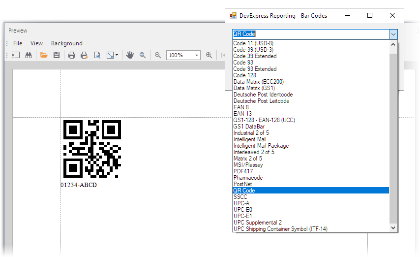

# How to Add a Bar Code to a Report

This example demonstrates how to add various bar codes to a report at runtime.

## Files to Look At

- [Form1.cs](CS/Form1.cs) ([Form1.vb](VB/Form1.vb))

## Documentation

- [Use Bar Codes](https://docs.devexpress.com/XtraReports/2613/detailed-guide-to-devexpress-reporting/use-report-controls/use-bar-codes?v=22.1)

## More Examples

- [How to Create a Custom DevExpress Report Control - Swiss QR Bill Implementation](https://github.com/DevExpress-Examples/Reporting-Custom-Controls)
